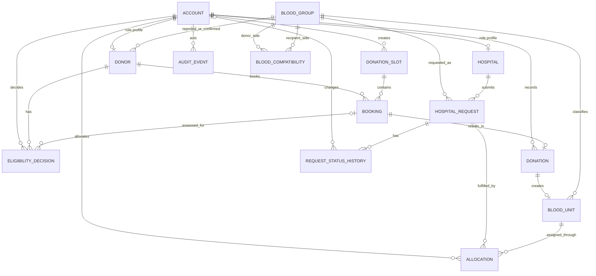

# Entity-Relationship Design

The following Mermaid ER diagram is the logical design. It can be rendered in a compatible Mermaid editor for a report. It is not a physical DDL diagram and omits some non-key attributes for legibility; the complete attribute dictionary is in `database-design.md` and `relational-schema.md`.

## Cardinality and optionality notes

- Account to Donor/Hospital is zero-or-one profile from the Account side; each profile has exactly one Account. Role/profile completeness and exclusivity are enforced by the application transaction because the FK graph alone cannot enforce “exactly one matching subtype.” Admin has no Donor or Hospital profile.
- Donor and DonationSlot each have zero or many bookings; every Booking has exactly one of each. UQ `(donor, slot)` prevents repeat same-slot bookings. Capacity is a transactional cross-row rule.
- Booking may produce zero or one Donation; every Donation references exactly one Booking. Donation is recorded even for incomplete/deferred attendance outcomes, so history is retained.
- Donation may produce zero or one unit; every BloodUnit comes from exactly one unique Donation. Rejected/incomplete donations have no unit.
- BloodCompatibility relates two BloodGroup rows in distinct directed roles; a pair is unique.
- Hospital has zero or many requests; each request belongs to exactly one hospital.
- Request has zero or many allocation history rows; a unit can have multiple historical `CANCELLED` allocations but at most one active `ALLOCATED`/`ISSUED` row.
- Request has one or many status history rows (initial Submitted row is inserted with request creation; later status changes are trigger-recorded). Every history row belongs to one request; actor may be null only for system-originated updates.
- AuditEvent has a typed subject identifier for entity changes and an optional/system actor. A `SYSTEM_TASK` run event may have a NULL subject ID. The polymorphic subject does not have a database FK; operational target rows are retained and subject type is whitelisted.

## Circularity review

There are no FK cycles in the selected model. Account is referenced by profiles and actor columns, while a profile's shared PK references Account. BloodCompatibility's two FKs both point to BloodGroup but do not point back. Donation references Booking; BloodUnit references Donation; Allocation references request and unit, with no reverse FK. RequestStatusHistory references Request, with no FK from Request back to history. Status and totals are not maintained through circular FK references.
